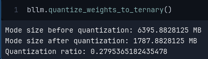

## bLLaMa

bLLaMa is a [b1.58](https://arxiv.org/pdf/2402.17764v1.pdf) LLaMa model.

### Set up

Both the module configuration dataclass and the module itself are contained on `bllama`. By default, the configuration is a 1.7B model, which can be found on `config.py`.

```python
from bllama import bLlamaConfig, bLlama

config = bLlamaConfig()
bllm = bLlama(config)
```

#### Training

bLLaMa is built as a Lightning module, so you may pass `pl.Trainer`s and `pl.LightningDataModules` for training tasks. To faciliate, some examples of datasets the corresponding datamodules are given on `utils`.

```python
from transformers import LlamaTokenizer
from utils import ShakespeareDataset, TextDataModule, GepetoDataset

tokenizer = LlamaTokenizer.from_pretrained("fxmarty/tiny-llama-fast-tokenizer")
dataset = ShakespeareDataset.from_file("/path/to/shakespeare/input.txt", tokenizer=tokenizer, max_length=1024)
dataloader = TextDataModule(dataset, batch_size=config.batch_size, train_test_split=0.9)
```

To setup a trainer, you may pass a `pl.Trainer` or a manually setup a training run.

```
import pytorch_lightning as pl

bllm_trainer = pl.Trainer(
    accelerator="gpu",
    max_epochs=1,
)

bllm_trainer.fit(bllm, dataloader)
```

#### Inference

The BitLinear layers of bLLaMa have 2 modes, one for training (`fp32`) and one for quantized inference (`int8`). To perform quantized inference, the weights have to be offline-quantized. bLLaMa has a built-in method to quantize the BitLinear modules for inference:



After quantization, the model can then generate with the `generate` method.

```python
bllm.generate(prompt="In a shocking turn of events,", tokenizer=tokenizer, max_len=200, do_sample=False, top_k=3, repetition_penalty=2)
```

Full precision inference is also allowed, but the model will promptly caution all the BitLinear layers that are not quantized.

### TODOS

- [x] Inference with `int8` BitLinear quantization
- [ ] Custom GEMM for lowbit inference
- [ ] KV Cache
- [ ] Model sharding / Parallel training optimizations
- [ ] Custom model saving for quantized tensors
- [ ] Full 1.7B model training

### Resources and inspiration

- [The Era of 1-bit LLMs: All Large Language Models are in 1.58 Bits](https://arxiv.org/pdf/2402.17764v1.pdf)
- [The Era of 1-bit LLMs: Training tips and FAQ](https://github.com/microsoft/unilm/blob/master/bitnet/The-Era-of-1-bit-LLMs__Training_Tips_Code_FAQ.pdf)
- [LLaMA: Open and Efficient Foundation Language Models](https://arxiv.org/pdf/2302.13971v1.pdf)
- [Official LLaMa implementation](https://github.com/meta-llama/llama/blob/main/llama/model.py#L80)
- [joey00072's BitNet implementation](https://github.com/joey00072/ohara/blob/master/experiments/bitnet/bitnet.py)

### Notes on training

This repo contains only the implementation and training code for bLLaMa. No (relevant) model checkpoints or model weights have been yet produced as it requires significantly more compute than I have at my disposal at the moment.

Nonetheless, small training runs using a 1.7B model were done to assess training performance. The training runs were done with ~15M tokens from [wikitext](https://huggingface.co/datasets/wikitext) and [minipile](https://huggingface.co/datasets/JeanKaddour/minipile).

Using a single NVIDIA A6000, due to the VRAM bottleneck, the batch size used was 1. This may indicate some issues with memory usage and/or optimization opportunities, as the full `fp32` model alone uses ~41GB for training.

The total test training time was 5 hours. Based on this, we can extrapolate that, with the current configuration, to achieve a Chinchilla-optimal 1.7B model, it would take ~472 hours of training on a A6000. 